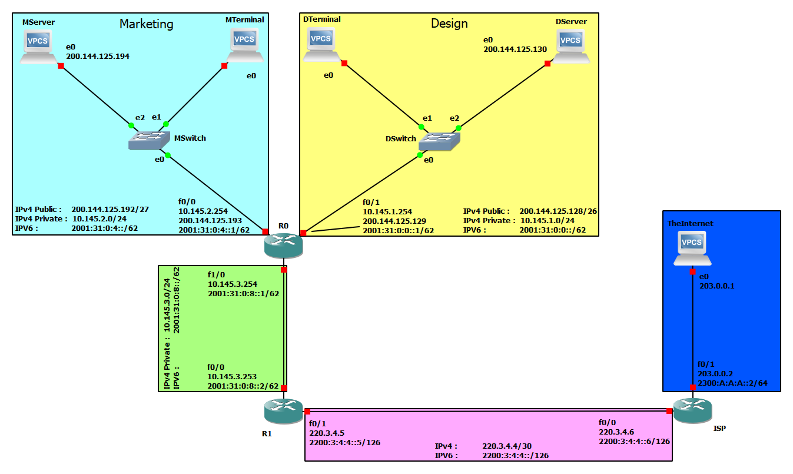

# Project 1

## Members
- David José Araújo Ferreira
  - Nº Mec.: 93444
- Luís Filipe Brunet
  - Nº Mec.: 91257

## General Network Information

### Public/Global IPs

|			|Network			|Mask / Prefix length	|
|:-:		|:-:				|:-:					|
|**IPv4**	|200.144.125.128	|255.255.255.128		|
|**IPv6**	|2001:31:0:0::		|60					|	

### Private IPs

|			|Network			|Mask				|
|:-:		|:-:				|:-:				|
|**IPv4**	|10.145.0.0			|255.255.0.0		|

## Department's Networks

### IPv4 Networks
At the moment, there are only two departments needing networks, but the entire configuration needs **four** networks, the table bellow shows some important data of this networks.

|Department	|Network		|Mask			|Broadcast address	|Default Gateway|#Max Hosts|
|:-:		|-:				|-:				|-:					|-:				|-:	|
|**Design**|10.145.1.0		|255.255.255.0	|10.145.1.255		|10.145.1.254	|	254|
|**Design**|200.144.125.128		|255.255.255.192	|200.144.125.191	|200.144.125.129	|62	|
|**Marketing**|10.145.2.0		|255.255.255.0	|10.145.2.255		|10.145.2.254	|254	|
|**Marketing**|200.144.125.192		|255.255.255.224	|200.144.125.223	|200.144.125.193	|30	|
|**R0 to R1**|10.145.3.0		|255.255.255.0	|10.145.3.255	|N/A	|254	|
|**R1 to ISP**|220.3.4.4		|255.255.255.252	|220.3.4.7	|N/A	|2	|

**Both** Marketing and Design networks are connected to a **single router**, **R0**. This router is responsible for dealing the connection of both private networks through a **private static network** to **R1**.

R0 for each interface, serves **both a private and a public** set of addresses, public being for the **servers** than are visible to the **outside internet**. 

## DHCP

The router is also responsible for dealing the **host's IP dynamically**, to accomplish this R0 is configured with **two DHCP pools**. This DHCP pools will deal the following ranges of addresses per network.

|Department		|Pools		|Minimum			|Maximum			|
|:-:			|-			|-					|-					|
|**Design**		|Pool 1		|10.145.**1.1**		|10.145.**1.254**	|
|**Marketing**	|Pool 2		|10.145.**2.1**		|10.145.**2.254**	|

Since the server has to be visible to the outside internet, the addresses of this machines must remain the same, and thus can't be given via DHCP by R0, they have to be configured both **manually and statically**, and have the following ranges.

|Department		|Minimum			|Maximum			|
|:-:			|-					|-					|
|**Design**		|200.144.125.**129**|200.144.125.**190**|
|**Marketing**	|200.145.125.**193**|200.143.125.**222**|

### IPv6 Networks

Since in IPV6 format all addresses are **global**, there won't be a need for **private and public** type addresses, all that is required is to define **four** different **subnets**, one for each each department (Design and Marketing), one for the connection between **R0 and R1** and the last one between **R1 and ISP**.

|Department		|Network		|Prefix length	|Default Gateway	|
|:-:			|-:				|-:				|-:					|
|**Design**		|2001:31:0:0::	|62				|2001:31:0:0::1		|
|**Marketing**	|2001:31:0:4::	|62				|2001:31:0:4::1		|
|**R0 to R1**	|2001:31:0:8::	|62				|N/A				|
|**R1 to ISP**	|2200:3:4:4::	|126			|N/A				|

## Static Routing
### IPv4
#### R0 to R1 and back

To be able to transmit data between **R0** and **R1**, since neither router is able to discover that the other is able to reach the network that the first one is trying to, a **static route** must be configured.

When sending, in **R0**, since we want to redirect packages. either to a another internal network, or if the IP is not recognized as internal, it must be an external internet IP, to redirect every package that classifies as such, a **gateway of last resort** must be configured. By doing so if the **destination IP** is not recognized, in last resort, the package is redirected to **R1**.

Upon receiving, in **R1**, because we defined Design and Marketing with **10.145.1.0** and **10.145.2.0** respectively, now when routing, we can define that every package that has as **destination** a host in **10.145.0.0/22**, has to go **through** **10.145.3.254**.

#### R1 to ISP and back

Between **R1** and the **ISP** a static route must also be configured, now with the range of **220.3.4.4/30**, with a mask of 30 bits, we are left with only **3** maximum hosts, each one having either **5**, **6** or **7** as the last section of the IP. In this project **R1 is 220.3.4.5** and **ISP is 220.3.4.6**.

Also in here, we have to propagate the logic of a **gateway of last resort** to be able to send packages from the **internal** networks **to the ISP** which then sends them to the Internet.

In the opposite direction, the ISP routes every package within the range **10.145.0.0/16** to **R1**, which then routes them to **R0** and subsequently to their respective networks.

### IPv6

Since in IPv6 we do not have the concept of private and public, just having global addresses, the routing is much simpler.

#### From inside to the outside

As in IPv4, here too the traffic will be statically routed between **R0** and **R1**, to do so, another subnet has to be configured, between **R0 and R1** we have the network:**2001:31:0:8::/62**. Based on this subnet, we can attribute the addresses **2001:31:0:8::1** to **R0** and **2001:31:0:8::2** to **R1**

Since in IPv6 there is no concept of **gateway of last resort**, what we can do is define the destination IP as **::** with a **prefix length of 0**, this way, every package which IPv6 destination is unknown to the current router, will be redirected to a **default router**, which in our case is the next router in line to the "Internet".

On sending, the only thing that changes between the configurations of R0 and R1 are the **default router addresses**. In **R0** the default address will be the one of **R1**, and in **R1** it will be the **ISP's** address.

On receiving traffic, it's even simpler. We know for a fact, that the IPv6 global network that we have access to is **2001:31:0:0::/60**, so we use this address and this prefix length in routing. Then, in **ISP** the next hop address will be off **R1's** address, and in **R1** it'll be **R0's** address.

 
 
 
 
 
 
 
 
 

### Summary of Static Routing

#### Internal to Internet

|Router	|Target network	|Mask / Prefix length	|Next hop		|
|:-:	|:-				|:-						|:-				|
|**R0**	|0.0.0.0		|0.0.0.0				|10.145.3.253	|
|**R1**	|0.0.0.0		|0.0.0.0				|220.3.4.6		|
|**R0**	|::				|0						|2001:31:0:8::2	|
|**R1**	|::				|0						|2200:3:4:4::6	|

#### Internet to Internal

|Router	|Target network	|Mask / Prefix length	|Next hop		|
|:-:	|-				|-						|-				|
|**R1**	|10.145.0.0		|255.255.252.0			|10.145.3.254	|
|**ISP**|200.144.125.128|255.255.255.128		|220.3.4.5		|
|**R1**	|2001:31::		|60						|2001:31:0:8::1	|
|**ISP**|2001:31::		|60						|2200:3:4:4::5	|

## NAT/PAT

Since we have a limited, and smaller than private, amount of **public** IPv4 addresses, we have to be careful when distributing them by the the internal devices.

Our range, shown in the table in the beginning, is **200.144.125.128/25** which means that we have a maximum of **127** addresses, and since two of these are reserved to **broadcast** (200.144.125.255) and to define the **network** (200.144.125.128), in actuality we are only left with **125** addresses.

Of this 125 addresses, **R1** only need **11** to configure the NAT/PAT

|Pool name	|Bottom range	|Top range		|		
|-			|-				|-				|
|NATPOOL	|200.144.125.225|200.144.125.235|

 
 
 
 
 
 
 
 
 
 
 
 

## Layout
